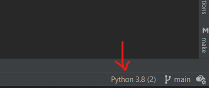

# Deep Learning reproduction of: Leveraging triplet loss for unsupervised action segmentation

This repository is part of the reproducibility project of the CS4240 Deep Learning course at TU Delft.

The reproduction is based on:
- this paper: https://arxiv.org/pdf/2304.06403v2.pdf  
- the publicly available code from: https://github.com/elenabbbuenob/TSA-ActionSeg
- and the Breakfast dataset: https://serre-lab.clps.brown.edu/resource/breakfast-actions-dataset/#Downloads

## Setup
1. Download anaconda and open the `Anaconda Prompt`
2. Create the environment: `conda create --name tsa-action-seg python=3.9`, this should say where the environment was created
   1. REMEMBER that file path, should be something like `environment location: C:\Users\...\anaconda3\envs\tsa-action-seg`, and you should find a file called `python.exe`, so full path (called from now ENV_PATH) should be something like `C:\Users\...\anaconda3\envs\tsa-action-seg\python.exe`
3. Activate the conda environment: `conda activate tsa-action-seg`
4. In the conda terminal go to the root path of this project (`C:\...\dl-action-segmentation\`), and run: `pip install -r requirements.txt`
5. Open Pycharm, in bottom right you can select your interpreter: 
6. Add the Conda environment that we just created, using the ENV_PATH from above 

## Datasets

### Breakfast dataset
Download ([BreakfastII_15fps_qvga_sync.tar.gz 3.6 GB](https://drive.google.com/open?id=1I70VymcaQypIcJ8TXhb2_AlSmoo6MUm4)) from: https://serre-lab.clps.brown.edu/resource/breakfast-actions-dataset/#Downloads, and we probably also need the "I3D feature (pretrained on Kinetics, no fine-tuning) for rgb and flow (2048 dim): [bf_kinetics_feat.tar.gz (27.7 GB)](https://drive.google.com/open?id=1I70VymcaQypIcJ8TXhb2_AlSmoo6MUm4)"

### Inria_YT dataset
Not relevant for our project, but you can look into this Github repo for details: https://github.com/jalayrac/instructionVideos

### Camma dataset
Silvia's suggestion, download from here: http://camma.u-strasbg.fr/datasets

## Run

### Do I have a GPU?
You can check if you have a GPU by running the file called `whats_my_GPU.py`

### Run on Breakfast dataset
In Pycharm you can right-click on `tsa.py` file > `More Run/Debug` > `Modify Run Configuration..` and in `Parameters` you should put:
- if you have a GPU: `--config_exp configs/breakfast_action.yml --gpu <NAME_OF_YOUR_GPU> --name <NAME_OF_EXPERIMENT>`
- if you don't have a GPU: `--config_exp configs/breakfast_action.yml --name <NAME_OF_EXPERIMENT>`
- example: `--config_exp configs/breakfast_action.yml --name experiment_1`

# TODO...
- [ ] TODO: we don't have the `/datasets/breakfast_action/mappping/mapping.txt` file, and IDK where to get it from!!!!!!!
  - Improved dense trajectories: [here](https://thoth.inrialpes.fr/people/wang/improved_trajectories.html) and [paper here](https://www.cv-foundation.org/openaccess/content_iccv_2013/papers/Wang_Action_Recognition_with_2013_ICCV_paper.pdf)
  - IDT features provided: [here](https://github.com/annusha/unsup_temp_embed) and [paper here](https://openaccess.thecvf.com/content_CVPR_2019/papers/Kukleva_Unsupervised_Learning_of_Action_Classes_With_Continuous_Temporal_Embedding_CVPR_2019_paper.pdf)
  - 